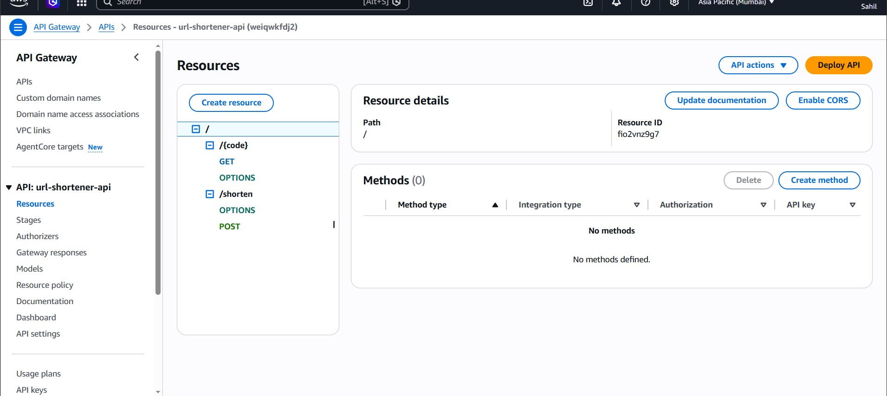
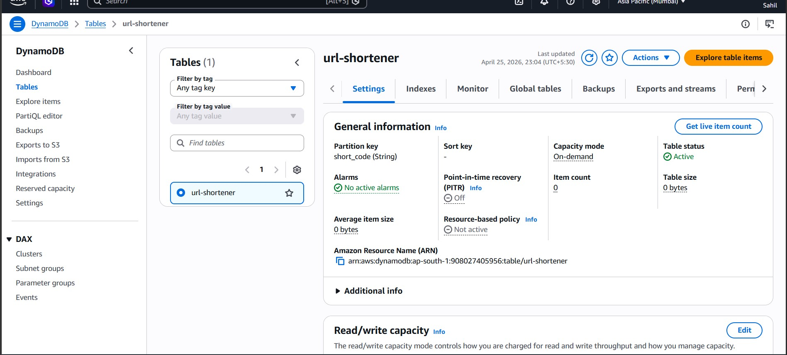
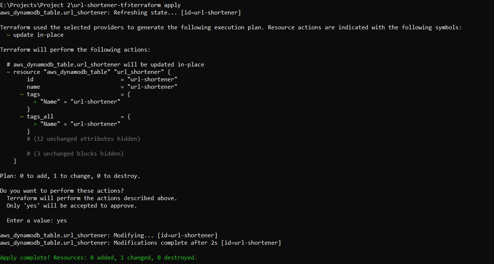
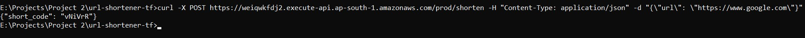

# Serverless URL Shortener — AWS

## Live API
- POST https://weiqwkfdj2.execute-api.ap-south-1.amazonaws.com/prod/shorten
- GET  https://weiqwkfdj2.execute-api.ap-south-1.amazonaws.com/prod/{code}

## Architecture
User → API Gateway → Lambda → DynamoDB → 301 Redirect

## Tech Stack
- AWS Lambda (Python 3.14)
- AWS DynamoDB (On-demand, TTL enabled)
- AWS API Gateway (REST API, Lambda Proxy integration)
- Terraform (IaC for DynamoDB)
- CORS enabled

## Features
- Generates unique 6-character short codes
- Auto-expiry of links after 30 days via DynamoDB TTL
- Fully serverless — no servers to manage
- Handles 1M requests/month within AWS free tier
- $0/month cost

## How It Works
1. Send a POST request with a long URL
2. Lambda generates a random 6-character code
3. Code + URL stored in DynamoDB with 30-day TTL
4. GET request with the code triggers a 301 redirect

## Screenshots
### API Gateway Resources

### DynamoDB Table

### Terraform Apply

### Live API Test

## Files
- create_function.py — Lambda to create short URLs
- redirect_function.py — Lambda to redirect to original URL
- main.tf — Terraform config for DynamoDB

## Cost
$0/month — entirely within AWS free tier